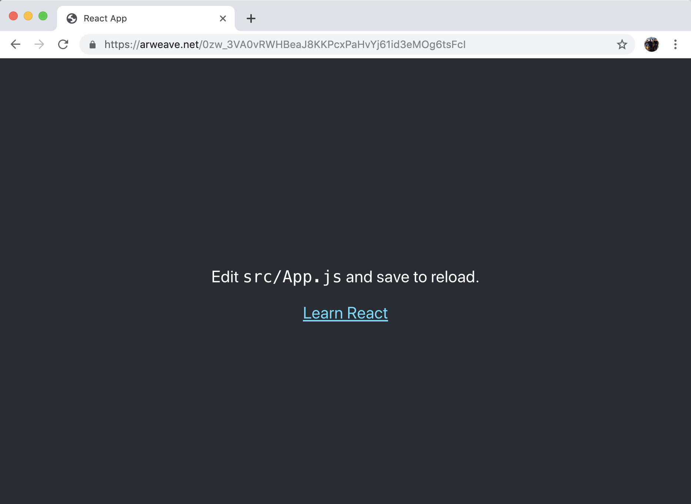

# ARWeave Simple React Permaweb Deployment

## 1 | Description 

Testing React app deployment on the AR Weave hosting blockchain platform. Meant for deploying to the AR permaweb. 

Example deployment found here: [https://arweave.net/0zw_3VA0vRWHBeaJ8KKPcxPaHvYj61id3eMOg6tsFcI](https://arweave.net/0zw_3VA0vRWHBeaJ8KKPcxPaHvYj61id3eMOg6tsFcI)



## 2 | Instructions

### 2.2 Ready the build

Install dependencies and build the project.

```
cd client
npm install
npm run build
```

This build is made to compile an `index.html` file made for local, instead of a server, file dependency paths. To reset it to default, remove the `homepage` property inside of `package.json`.

The Arweave CLI will not package images into a single upload. To include images, upload the image files separately on Arweave then link, or link to your externally hosted images such as uploading your images to https://imgur.com. 

### 2.3 Ready your AR account

Create an AR wallet with AR. Wallet creation address is [https://tokens.arweave.org/](https://tokens.arweave.org/). This should provide you with a json file. 

### 2.4 Install the AR CLI

Install the CLI

```
npm install -g arweave-deploy
```

### 2.5 Use the AR CLI to Deploy your build

Load your AR json wallet file to the AR CLI.

```
arweave key-save path/to/arweave-key.json
```

Now you can run deploy commands without passing your key each time. 


Test packaging your React app build.

```
arweave package path-to/index.html packaged.html
```

If packaged.html renders as intended, deploy to the AR permaweb. 

```
arweave deploy path-to-my/index.html --package
```

Example deployment found here: [https://arweave.net/0zw_3VA0vRWHBeaJ8KKPcxPaHvYj61id3eMOg6tsFcI](https://arweave.net/0zw_3VA0vRWHBeaJ8KKPcxPaHvYj61id3eMOg6tsFcI)